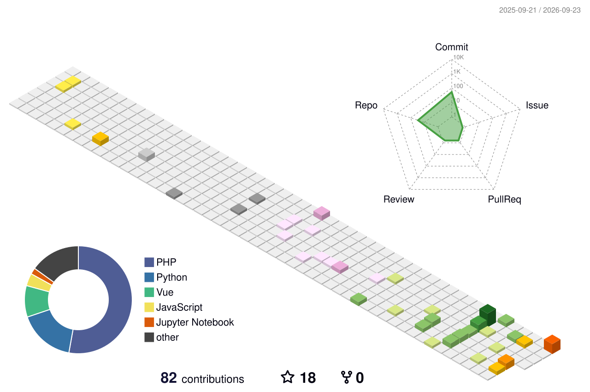

---

## About Me

I'm a data-focused developer working across the full data lifecycle — from ingesting
streaming sensor data over MQTT to orchestrating ETL pipelines, training ML/DL models,
and serving insights through FastAPI backends and interactive dashboards.

- 🎓 Fourth-year **Data Science** student at the **Institute of Technology of Cambodia (ITC)**
- 🧠 Building **real-time ETL pipelines**, **RAG / LLM applications**, and **REST APIs**
- 📈 Focus: **Data Engineering · Machine Learning · Backend Engineering · IoT Data**
- 🛠️ Passionate about turning raw data into clean, reliable, and useful systems

---

## Currently Learning

- Real-time data pipelines with **Apache Airflow + PySpark**
- Time-series storage and analytics with **TimescaleDB**
- Khmer / English NLP and **RAG** chatbot architectures
- Scalable backend services with **FastAPI** and **Docker**

---

## Tech Stack

All icons are served from [simple-icons](https://simple-icons.org) — verified, up-to-date, and rendered in brand colors.

### Languages

<code></code>
<code></code>
<code></code>
<code></code>
<code></code>

### Data & AI

<code></code>
<code></code>
<code></code>
<code></code>
<code></code>
<code></code>
<code></code>
<code></code>
<code></code>

### Backend

<code></code>
<code></code>
<code></code>
<code></code>

### Database & IoT

<code></code>
<code></code>
<code></code>
<code></code>

### DevOps & Tools

<code></code>
<code></code>
<code></code>
<code></code>
<code></code>
<code></code>

 
Also working with: **SQL** · **REST APIs** · **EMQX** · **TimescaleDB time-series** · **paho-mqtt**

---

## Featured Projects

<table>
  <tr>
    <td width="50%">
      <h3 align="center">Real-Time Weather ETL Pipeline</h3>
      
End-to-end data engineering pipeline collecting live weather data for 8 Cambodian cities — orchestrated with Airflow, transformed with PySpark, stored in PostgreSQL, served via Streamlit, fully containerized with Docker.

      
<b>Airflow · PySpark · PostgreSQL · Streamlit · Docker</b>

      

    </td>
    <td width="50%">
      <h3 align="center">IoT Platform API (MQTT · EMQX)</h3>
      
IoT data platform for smart-meter sensor telemetry — an EMQX MQTT broker feeds a FastAPI service that ingests, validates, and stores time-series sensor readings in TimescaleDB.

      
<b>MQTT · EMQX · FastAPI · TimescaleDB · Docker</b>

      

    </td>
  </tr>
  <tr>
    <td width="50%">
      <h3 align="center">English-to-Khmer Translator</h3>
      
Sequence-to-sequence machine translation model built with TensorFlow/Keras (LSTM) and deployed as an interactive Streamlit app.

      
<b>TensorFlow · Keras · LSTM · Streamlit</b>

      

    </td>
    <td width="50%">
      <h3 align="center">Image Caption Generator</h3>
      
Deep learning image captioning system combining computer vision and NLP, served through a Streamlit interface.

      
<b>TensorFlow · Image Captioning · Streamlit</b>

      

    </td>
  </tr>
  <tr>
    <td width="50%">
      <h3 align="center">Rice Yield Prediction System</h3>
      
Machine learning project predicting rice yield using scikit-learn models, exposed through a web interface.

      
<b>scikit-learn · Python · Web</b>

      

    </td>
    <td width="50%">
      <h3 align="center">Student Management System API</h3>
      
RESTful backend built with FastAPI and PostgreSQL for managing students, teachers, and courses — with JWT authentication, Docker Compose, and Alembic migrations.

      
<b>FastAPI · PostgreSQL · JWT · Docker</b>

      

    </td>
  </tr>
</table>

---

## GitHub Statistics

<picture>
  <source media="(prefers-color-scheme: dark)" srcset="https://github-readme-streak-stats.herokuapp.com/?user=YongLyhor&theme=github-dark-blue&hide_border=true">
  <source media="(prefers-color-scheme: light)" srcset="https://github-readme-streak-stats.herokuapp.com/?user=YongLyhor&theme=default&hide_border=true">
  
</picture>

---

## Contribution Activity

### 🐍 Contribution Snake
*(automatically regenerated daily)*

<picture>
  <source media="(prefers-color-scheme: dark)" srcset="output/github-contribution-grid-snake-dark.svg">
  <source media="(prefers-color-scheme: light)" srcset="output/github-contribution-grid-snake.svg">
  
</picture>

### 👾 Pac-Man Contribution Graph
*(automatically regenerated daily)*

<picture>
  <source media="(prefers-color-scheme: dark)" srcset="output/pacman-contribution-graph-dark.svg">
  <source media="(prefers-color-scheme: light)" srcset="output/pacman-contribution-graph.svg">
  
</picture>

### 🧊 3D Contribution Calendar
*(automatically regenerated daily)*

<!--
The snake, Pac-Man, and 3D contribution visuals are refreshed automatically by the workflows in `.github/workflows/`:
  - generate-snake       → every day at 00:00 UTC
  - generate-pacman      → every day at 01:00 UTC
  - generate-profile-3d  → every day at 18:00 UTC
Run each workflow manually once (Actions → Run workflow) after cloning to seed the initial SVGs.
Note: github-readme-stats and github-profile-trophy are currently unavailable upstream (HTTP 503/402),
so live per-repo stat cards are intentionally not included.
-->

---

## Let's Connect

